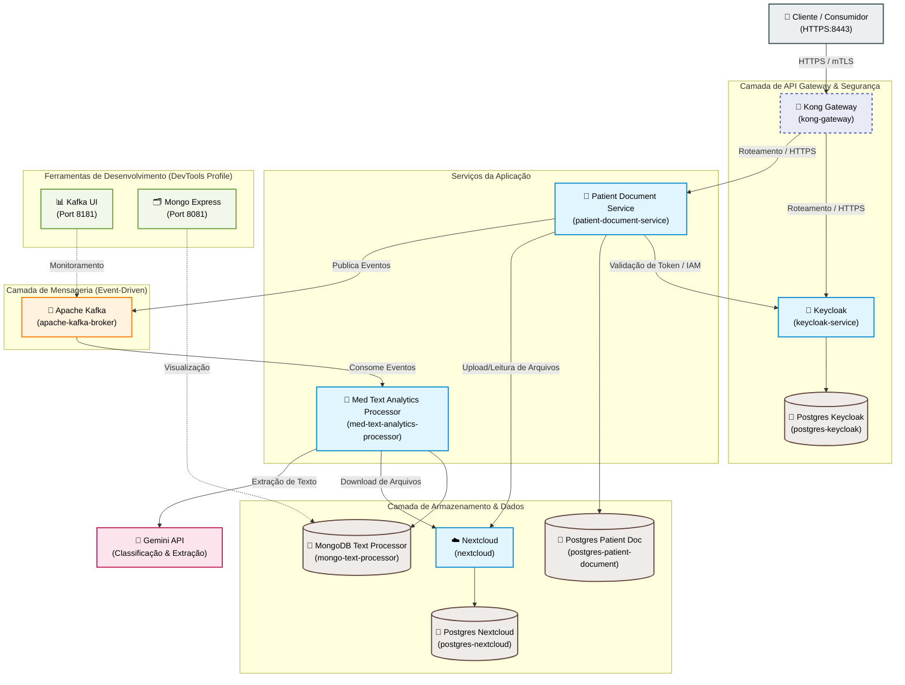

# infra-meu-historico-saude

Este repositório contém a infraestrutura e a definição dos serviços que compõem a solução **Meu Histórico de Saúde**. A arquitetura é baseada em microserviços, utilizando o **Kong Gateway** como ponto único de entrada, **Keycloak** para autenticação e autorização (IAM), **Apache Kafka** para mensageria/eventos, **Nextcloud** como provedor de armazenamento de arquivos e bancos de dados dedicados para cada componente.

## Desenho da Arquitetura

O diagrama abaixo ilustra a arquitetura da solução e a comunicação entre os componentes:

---

## Componentes da Arquitetura

### 1. Gateway & Segurança
*   **Kong Gateway (`kong-gateway`)**: Atua como o API Gateway da aplicação, centralizando o tráfego de entrada via HTTPS/mTLS (porta `8443`) e realizando o roteamento inteligente para os serviços internos (`patient-document-service` e `keycloak-service`).
*   **Keycloak (`keycloak-service`)**: Provedor de Identidade e Acesso (IAM) responsável pela autenticação e autorização, utilizando protocolo OpenID Connect (OIDC).
*   **Postgres Keycloak (`postgres-keycloak`)**: Banco de dados relacional dedicado para armazenar configurações, usuários e realms do Keycloak.

### 2. Serviços da Aplicação
*   **Patient Document Service (`patient-document-service`)**: Microserviço responsável pela gestão dos documentos de saúde dos pacientes. Integra-se com o Nextcloud para armazenamento de arquivos e publica mensagens no Kafka ao registrar novos documentos.
*   **Postgres Patient Doc (`postgres-patient-document`)**: Banco de dados relacional dedicado para armazenar os metadados dos documentos dos pacientes.
*   **Med Text Analytics Processor (`med-text-analytics-processor`)**: Processador assíncrono que consome eventos do Kafka, baixa os documentos do Nextcloud, extrai informações clínicas relevantes utilizando a **API do Gemini** e armazena os resultados processados.
*   **MongoDB Text Processor (`mongo-text-processor`)**: Banco de dados NoSQL utilizado para armazenar os textos processados e as análises médicas estruturadas.

### 3. Armazenamento de Arquivos
*   **Nextcloud (`nextcloud`)**: Solução de armazenamento em nuvem privada utilizada como repositório seguro para guardar as imagens dos exames/documentos médicos.
*   **Postgres Nextcloud (`postgres-nextcloud`)**: Banco de dados relacional dedicado às operações internas do Nextcloud.

### 4. Mensageria & Integração Event-Driven
*   **Apache Kafka (`apache-kafka-broker`)**: Broker de mensageria responsável pela comunicação assíncrona entre o `patient-document-service` e o `med-text-analytics-processor`.

### 5. Ferramentas de Desenvolvimento (Perfil `devtools`)
*   **Kafka UI**: Interface gráfica rodando na porta `8181` para visualização e gerenciamento de tópicos, partições e mensagens do Kafka.
*   **Mongo Express**: Interface administrativa baseada em web para gerenciar e visualizar os dados no MongoDB (porta `8081`).
