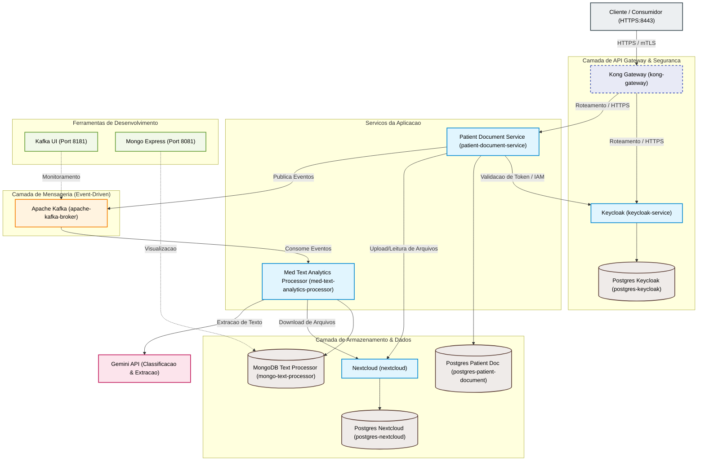

# Relatório do projeto
Objetivo: documentar o processo de desenvolvimento e facilitar a avaliação detalhada.

## 1. Resumo executivo
O Meu Histórico de Saúde consiste em um cofre digital inteligente voltado para a centralização e organização de documentos clínicos e históricos de saúde dos pacientes. A solução tem como objetivo permitir que o cidadão realize o envio de exames, laudos, receitas e outros registros, os quais são armazenados de forma segura e processados assincronamente por meio de inteligência artificial para a extração de dados estruturados. Esses dados alimentam uma linha do tempo organizada cronologicamente.

O impacto esperado baseia-se no conceito de custódia híbrida: garantir autonomia de armazenamento e portabilidade para os usuários que possuem capacidade tecnológica de gerir seus próprios dados (cofre pessoal), ao mesmo tempo em que oferece proteção e assistência digital para cidadãos em situação de vulnerabilidade (cofre público assistido). Dessa forma, a solução promove a continuidade do cuidado de saúde e reduz gargalos no atendimento médico.

## 2. Problema identificado
O paciente possui o direito de acessar seus dados de saúde, mas, na prática, depara-se com a fragmentação dessas informações, que ficam dispersas em diferentes sistemas, clínicas privadas, hospitais, receitas físicas e exames em papel.

Os problemas específicos identificados na infraestrutura do SUS incluem:
- Dependência de documentos físicos: O uso de papel continua predominante em regiões periféricas, zonas rurais e pequenos municípios devido a limitações de infraestrutura local para a digitalização completa.
- Desconexão com a rede privada: Procedimentos, exames e vacinas realizados pontualmente no setor privado para celeridade do diagnóstico não são consolidados na base de dados do e-SUS.
- Escopo limitado de exames: A visualização de exames no sistema do e-SUS restringe-se historicamente a diagnósticos específicos, o que acarreta a solicitação redundante de novos exames cujos resultados recentes já estariam disponíveis.
- Lacuna no histórico de medicamentos: O e-SUS registra apenas medicamentos dispensados por programas governamentais, omitindo tratamentos adquiridos de forma autônoma pelo paciente.
- Ineficiência na consulta médica: A ausência de um histórico centralizado e estruturado obriga os médicos a reconstruírem o histórico de forma manual e apressada durante a consulta, prejudicando a precisão do atendimento.

## 3. Descrição da solução
A solução propõe um cofre digital de saúde integrado a uma linha do tempo inteligente, organizada por especialidade médica, acessível pelo paciente e compartilhável de forma controlada com profissionais de saúde. O fluxo operacional do sistema compreende:
1. Upload de documento de saúde bruto (exame, receita, laudo ou encaminhamento) pelo próprio paciente ou por um atendente assistido.
2. Processamento assíncrono por IA que classifica o arquivo e extrai metadados clínicos importantes (como tipo de documento, data, especialidade provável e resultados de exames), sem emitir diagnósticos.
3. Organização e indexação das informações estruturadas no sistema.
4. Visualização consolidada pelo paciente através de uma linha do tempo cronológica.
5. Compartilhamento temporário de um resumo das informações com o profissional de saúde responsável no momento do atendimento.
6. Aceleração da consulta médica com base em dados consolidados e confiáveis.

O modelo de custódia híbrida garante a inclusão de pessoas com baixa alfabetização digital ou sem acesso a dispositivos adequados através de infraestruturas públicas assistidas (como Unidades Básicas de Saúde).

## 4. Processo de desenvolvimento
O desenvolvimento da solução baseou-se em um plano estruturado de entregas incrementais divididas em etapas lógicas de execução técnica:
- Modelagem de Integração e Processamento: Foco inicial na definição do contrato de resposta agregado do processador e na integração com a API de inteligência artificial de maneira assíncrona.
- Persistência e Consumo de Mensageria: Implementação do consumo de eventos e garantia de idempotência no serviço de documentos do paciente, estruturando o banco de dados de destino e atualizando a linha do tempo.
- Estabilização e Portabilidade: Ajustes finais de autenticação, geração do pacote de portabilidade de dados e preparação do ambiente de testes integrados.

- TO DO: Detalhar o processo de brainstorming, etapas de design thinking e prototipação conduzidos pela equipe.

## 5. Detalhes técnicos
A arquitetura do sistema baseia-se em microserviços orientados a eventos, utilizando os seguintes componentes tecnológicos:
- Gateway de APIs: Kong Gateway para centralização do tráfego HTTPS/mTLS e roteamento seguro.
- Provedor de Identidade (IAM): Keycloak para autenticação e autorização via OpenID Connect.
- Armazenamento de Arquivos: Nextcloud para o repositório seguro dos documentos originais enviados.
- Mensageria: Apache Kafka para comunicação assíncrona e desacoplada entre os microserviços.
- Serviços de Aplicação: Patient Document Service (gestão de documentos) e Med Text Analytics Processor (processador integrado à API do Gemini para extração de informações).
- Bancos de Dados: PostgreSQL (para metadados do Keycloak, Nextcloud e Patient Document Service) e MongoDB (para o processador de texto analítico).
- Orquestração: Docker Compose para execução e gerenciamento dos containers.

Abaixo consta o diagrama da arquitetura implementada:

## 6. Links Úteis
- TO DO: Inserir o link do repositorio de codigo do projeto (GitHub/GitLab).
- [Narrativa e Escopo do MVP](file:///d:/workspace/fiap-hackathon-10ADJT/docs/mvp-hackathon-custodia-hibrida.md)
- [Guia de Desenvolvimento Local](file:///d:/workspace/fiap-hackathon-10ADJT/docs/local-development.md)

## 7. Aprendizados e próximos passos

### O que a equipe aprendeu com o projeto?
- TO DO: Relatar as principais licoes aprendidas, desafios de integracao superados e competencias adquiridas durante o desenvolvimento da solucao.

### O que pode ser aprimorado ou adicionado no futuro?
- Integrar a solucao com a Rede Nacional de Dados em Saude (RNDS) e adotar o padrao de interoperabilidade FHIR (Fast Healthcare Interoperability Resources).
- Implementar autenticacao centralizada via integracao oficial com a plataforma Gov.br.
- Desenvolver conectores de armazenamento pessoal para provedores de nuvem privada (como Google Drive, Dropbox e OneDrive).
- Habilitar o compartilhamento temporario de exames com profissionais de saude por meio de chaves temporarias ou codigos QR, com funcionalidade completa de revogacao de acesso.
- Estruturar o cofre publico assistido para permitir a delegacao de acesso a representantes legais e suporte a prontuarios multiprofissionais integrados.
- Calibrar o processador de analise de texto para classificar documentos por especialidade medica de forma automatica com indices de confianca definidos.
