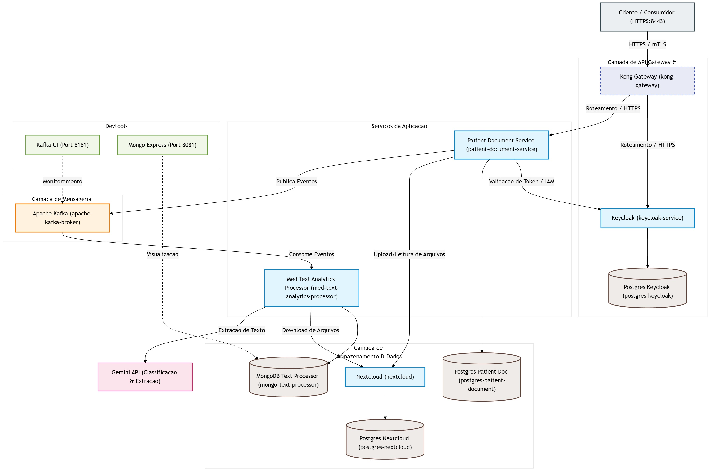

# Hackathon FIAP — Meu Histórico de Saúde

## Projeto

**Curso:** Pós-Graduação em Arquitetura e Desenvolvimento em Java  
**Tema do Hackathon:** Inovação para otimização do atendimento no SUS  
**Solução:** Meu Histórico de Saúde — cofre digital inteligente para centralização, organização e compartilhamento controlado de documentos clínicos  
**Repositórios:** `infra-meu-historico-saude`, `patient-document-service` e `med-text-analytics-processor`

## Equipe

| Integrante | RM | E-mail | Principais responsabilidades |
|---|---:|---|---|
| Alexandre Belisário Duarte Leite de Andrade | RM367163 | alexbdla@gmail.com | Patient Document Service, integração entre serviços, segurança, collection do Postman, validação ponta a ponta e documentação |
| Kervin Sama Candido da Silva | RM367345 | kervincandido@gmail.com | Med Text Analytics Processor, integração com IA, infraestrutura, mensageria e orquestração do ambiente |

## Links principais

| Item | Link |
|---|---|
| Infraestrutura e orquestração | [infra-meu-historico-saude](https://github.com/KervinCandido/infra-meu-historico-saude) |
| Processamento de documentos com IA | [med-text-analytics-processor](https://github.com/KervinCandido/med-text-analytics-processor) |
| Gestão de pacientes e documentos | [patient-document-service](https://github.com/alex-dev-br/patient-document-service) |
| Artefatos e guia de validação no Postman | [pasta postman](https://github.com/KervinCandido/infra-meu-historico-saude/tree/main/postman) |
| Visão de custódia híbrida | [mvp-hackathon-custodia-hibrida.md](https://github.com/KervinCandido/infra-meu-historico-saude/blob/main/docs/mvp-hackathon-custodia-hibrida.md) |
| Diagrama de arquitetura | [diagrama-arquitetura.jpg](https://github.com/KervinCandido/infra-meu-historico-saude/blob/main/docs/diagrama-arquitetura.jpg) |

# Relatório do projeto

## 1. Resumo executivo

O **Meu Histórico de Saúde** é um MVP backend de cofre digital inteligente para centralização e organização de documentos clínicos. A solução permite que um paciente autenticado seja cadastrado, envie um documento de saúde, acompanhe seu processamento assíncrono, consulte os dados extraídos em uma linha do tempo cronológica e mantenha acesso ao arquivo original.

O documento é armazenado no Nextcloud e processado por um microsserviço integrado ao Gemini. A comunicação entre os serviços ocorre por eventos no Apache Kafka, permitindo que o envio do arquivo e sua análise sejam desacoplados. A inteligência artificial classifica o documento e extrai informações estruturadas, como tipo documental, data, especialidade provável, resumo e dados específicos do conteúdo. A solução não realiza diagnóstico e não substitui a análise de um profissional de saúde.

O MVP também implementa um fluxo de compartilhamento controlado. O paciente pode conceder ao médico uma autorização temporária de leitura, definir uma data de expiração, manter o download do arquivo original bloqueado e revogar o acesso a qualquer momento. A revogação produz efeito imediato, enquanto o histórico da concessão permanece disponível para rastreabilidade.

Como visão de evolução, o projeto propõe um modelo de **custódia híbrida**:

- **cofre pessoal:** autonomia, portabilidade e controle pelo próprio paciente, núcleo demonstrado no MVP;
- **cofre público assistido:** suporte futuro a cidadãos em situação de vulnerabilidade digital, por meio de atendimento institucional e mecanismos formais de representação e consentimento.

O impacto esperado é melhorar a continuidade do cuidado, reduzir o tempo gasto na reconstrução manual do histórico durante a consulta e facilitar o acesso seguro a documentos produzidos em diferentes momentos e estabelecimentos.

---

## 2. Problema identificado

Informações de saúde podem permanecer fragmentadas entre estabelecimentos, sistemas, arquivos digitais, documentos em papel e registros mantidos pelo próprio paciente. Mesmo com iniciativas de digitalização e integração, nem todo documento produzido ao longo da vida do cidadão está necessariamente disponível em uma visão única no momento do atendimento.

Essa fragmentação gera dificuldades para pacientes e profissionais:

- documentos antigos podem ser perdidos ou esquecidos;
- exames realizados em contextos diferentes podem não estar prontamente acessíveis;
- receitas e laudos físicos podem se deteriorar;
- o paciente pode depender de fotografias, mensagens ou arquivos dispersos;
- o médico precisa reconstruir parte do histórico durante uma consulta de duração limitada;
- a ausência de informações recentes pode contribuir para repetição de perguntas, procedimentos ou exames;
- pessoas com baixa alfabetização digital enfrentam barreiras adicionais para organizar e apresentar seus registros.

### 2.1 Caso de uso de referência

Considere uma paciente que chega a uma nova unidade de atendimento com exames impressos, fotografias no celular e documentos recebidos por diferentes canais. O profissional de saúde não conhece seu histórico e dispõe de pouco tempo para localizar as informações relevantes.

Com o Meu Histórico de Saúde, a paciente pode:

1. armazenar o documento em seu cofre;
2. permitir que o sistema organize seus metadados;
3. consultar o registro em uma linha do tempo;
4. conceder temporariamente acesso de leitura ao médico;
5. permitir o download do arquivo original;
6. revogar a autorização de consulta e download após o atendimento.

A proposta não substitui sistemas oficiais de prontuário nem a avaliação clínica. Ela atua como uma camada de organização, portabilidade e compartilhamento controlado de documentos sob a perspectiva do paciente.

---

## 3. Descrição da solução

A solução é formada por dois serviços de aplicação e uma infraestrutura integrada:

- o **Patient Document Service** gerencia pacientes, documentos, metadados, timeline, arquivos e autorizações;
- o **Med Text Analytics Processor** classifica e extrai informações dos documentos com apoio de inteligência artificial;
- o repositório de infraestrutura orquestra os componentes necessários para execução local e demonstração.

### 3.1 Fluxo principal do documento

1. O paciente é autenticado pelo Keycloak.
2. O paciente é cadastrado no Patient Document Service.
3. O usuário envia um documento digital. Na demonstração oficial é utilizada uma imagem fictícia de exame laboratorial.
4. O arquivo original é armazenado no Nextcloud.
5. O Patient Document Service registra os metadados e publica um evento no Kafka.
6. O processador consome o evento, recupera o arquivo e realiza a classificação e a extração.
7. O resultado é persistido no MongoDB e publicado novamente por meio de um evento agregado.
8. O Patient Document Service consome a resposta, atualiza o estado do documento e disponibiliza os dados processados.
9. O paciente consulta o documento, a listagem paginada, os resultados e a timeline.
10. O paciente pode baixar o arquivo original.

O processamento é assíncrono. Por isso, o documento passa por estados intermediários antes de chegar ao estado final de sucesso ou falha. Esse desenho evita manter a requisição de upload aberta enquanto a análise é executada.

### 3.2 Dados estruturados pela IA

Conforme o tipo de documento, o processador pode produzir informações como:

- tipo documental;
- data do documento;
- especialidade provável;
- descrição ou resumo;
- palavras-chave;
- campos específicos de exames e laudos;
- identificadores necessários para correlação e rastreabilidade técnica.

Essas informações ajudam na organização e na busca. Elas não constituem diagnóstico, prescrição ou recomendação clínica automática.

### 3.3 Compartilhamento controlado

O MVP implementa compartilhamento temporário entre dois perfis humanos fictícios:

- `demo.patient`: representa o paciente proprietário dos documentos;
- `demo.doctor`: representa o profissional de saúde.

A autenticação do médico não concede acesso automático ao paciente. Para que a consulta seja permitida, deve existir uma autorização ativa e compatível com a operação solicitada.

No fluxo demonstrado, o paciente cria uma concessão com:

- identificação do médico pelo `subject` autenticado;
- permissão de leitura;
- download não autorizado;
- data de expiração;
- possibilidade de revogação.

Com a concessão ativa, o médico consegue consultar os documentos compartilhados. A tentativa de download permanece bloqueada. Depois da revogação, a consulta volta a ser negada imediatamente.

### 3.4 Escopo funcional implementado e validado

O MVP foi validado ponta a ponta com dados fictícios por meio do Postman.

Funcionalidades demonstradas:

- autenticação técnica com `client_credentials`;
- autenticação humana com Authorization Code e PKCE;
- validação das identidades `demo.patient` e `demo.doctor`;
- publicação da especificação OpenAPI e acesso ao Swagger UI;
- cadastro e consulta de pacientes;
- upload e armazenamento do documento original;
- processamento assíncrono por Kafka;
- classificação e extração com IA;
- acompanhamento do status do processamento;
- consulta de documentos e resultados;
- listagem paginada;
- timeline cronológica;
- download do original pelo paciente;
- separação entre autenticação e autorização;
- respostas `401`, `403`, `200`, `201` e `204` conforme o cenário;
- compartilhamento temporário entre paciente e médico;
- permissão de leitura separada da permissão de download;
- revogação com efeito imediato;
- preservação do histórico da concessão revogada.

A sequência principal validada no fluxo de compartilhamento foi:

```text
403 → 201 → 200 → 200 → 403 → 204 → 403 → 200
```

Essa sequência representa, respectivamente: acesso negado antes da concessão, criação do compartilhamento, confirmação da concessão, consulta autorizada pelo médico, download bloqueado, revogação, perda do acesso e consulta do histórico da revogação pelo paciente.

### 3.5 Diferenciais e inovação

Os principais diferenciais da proposta são:

- controle do compartilhamento pelo paciente;
- autorização temporária, granular e revogável;
- separação entre leitura das informações e download do original;
- organização automática dos documentos sem emissão de diagnóstico;
- arquitetura orientada a eventos, que desacopla armazenamento e processamento;
- visão de custódia híbrida, unindo autonomia individual e inclusão digital assistida;
- possibilidade de integração futura com ecossistemas públicos e padrões de interoperabilidade.

### 3.6 Implementado no MVP e evolução futura

| Implementado no MVP | Evolução prevista |
|---|---|
| Núcleo do cofre pessoal | Cofre público assistido |
| Perfis de paciente e médico | Perfil de atendente público ou representante |
| Upload e armazenamento no Nextcloud | Conectores com Google Drive, OneDrive e Dropbox |
| Processamento assíncrono com Kafka e IA | Integração com RNDS e FHIR |
| Timeline cronológica com dados processados | Dashboard clínico e visualizações de evolução |
| Download do original pelo paciente | Exportação padronizada e portabilidade ampliada |
| Compartilhamento temporário | QR code ou chave temporária |
| Revogação imediata | Escopo por especialidade e intervalo documental |
| Permissões separadas de leitura e download | Consentimento assistido e representação formal |
| Histórico da concessão e revogação | Auditoria completa de consultas e downloads |
| Ambiente local com TLS e autenticação | Hardening, observabilidade e operação em produção |

---

## 4. Processo de desenvolvimento

O desenvolvimento foi conduzido de forma incremental, com priorização do núcleo necessário para demonstrar a viabilidade da solução.

### 4.1 Definição do problema e do escopo

A equipe partiu do problema de fragmentação dos documentos de saúde e da necessidade de melhorar a continuidade do atendimento. A proposta inicial foi refinada até chegar ao conceito de cofre digital com processamento assíncrono e controle de acesso pelo paciente.

O escopo do MVP foi reduzido ao conjunto de funcionalidades capazes de demonstrar valor sem necessidade de front-end, em conformidade com o enunciado do Hackathon:

- cadastro do paciente;
- upload;
- armazenamento;
- processamento;
- timeline;
- download pelo proprietário;
- segurança;
- compartilhamento e revogação.

### 4.2 Desenho da arquitetura

A solução foi dividida em três repositórios:

1. infraestrutura e orquestração;
2. serviço de pacientes e documentos;
3. processador de documentos integrado à IA.

Essa separação permitiu definir responsabilidades, tecnologias e ciclos de evolução próprios para cada parte.

Também foram definidos:

- linguagem ubíqua;
- eventos de integração;
- identificadores de correlação;
- estados de processamento;
- responsabilidades de persistência;
- regras de autorização;
- contratos de sucesso e falha.

### 4.3 Prototipação da inteligência artificial

A integração com o Gemini foi inicialmente prototipada para validar duas etapas:

1. classificação do documento;
2. extração dos dados específicos conforme a classificação.

Os prompts e estratégias de extração foram ajustados para produzir dados estruturados, mantendo explícito que a IA não deveria realizar diagnóstico.

### 4.4 Implementação incremental

A construção ocorreu em etapas:

- upload e persistência dos metadados;
- armazenamento no Nextcloud;
- publicação dos eventos;
- consumo pelo processador;
- persistência do resultado;
- evento agregado de resposta;
- atualização do documento;
- autenticação e autorização;
- timeline e consultas;
- compartilhamento e revogação;
- scripts de demonstração;
- documentação e collection do Postman.

Foram utilizados branches, commits e pull requests para organizar as entregas e revisar as integrações entre os repositórios.

### 4.5 Confiabilidade e resiliência

O fluxo assíncrono incorporou padrões de Inbox e Outbox para reduzir riscos de perda e duplicidade de mensagens.

Foram aplicados mecanismos de resiliência em diferentes pontos:

- tentativas de processamento no consumo das mensagens;
- tratamento de falhas e mensagens inválidas;
- filas de erro para cenários não processáveis;
- limitação de taxa na integração com a IA;
- `Retry`, `CircuitBreaker`, `Fallback` e backoff em operações críticas de publicação e processamento;
- idempotência baseada em identificadores de evento e correlação.

### 4.6 Validação interna

A equipe realizou validações em diferentes níveis:

- testes unitários;
- testes de integração;
- testes do fluxo assíncrono;
- validação dos contratos de mensageria;
- validação do Docker Compose;
- verificação da documentação OpenAPI;
- testes manuais e automatizados no Postman;
- matriz de autorização;
- execução completa do compartilhamento e da revogação.

A collection do Postman foi organizada de acordo com a jornada da demonstração e contém scripts que validam respostas, status e identificadores, reduzindo a dependência de operações manuais.

### 4.7 Preparação da entrega

Na etapa final, a equipe:

- consolidou a infraestrutura de demonstração;
- criou perfis fictícios de paciente e médico;
- revisou os certificados locais;
- validou a execução em uma instalação limpa;
- revisou a collection e o environment;
- documentou a ordem de execução;
- preparou o roteiro do vídeo do MVP;
- separou claramente as funcionalidades implementadas das evoluções futuras.

---

## 5. Detalhes técnicos

### 5.1 Visão arquitetural

A arquitetura utiliza microsserviços orientados a eventos.

```text
Paciente ou médico
        |
        | HTTPS + OAuth 2.0 / OpenID Connect
        v
Kong Gateway
        |
        +--------------------+
        |                    |
        v                    v
Keycloak             Patient Document Service
                             |
               +-------------+-------------+
               |                           |
               v                           v
          PostgreSQL                  Nextcloud
               |
               | evento de processamento
               v
          Apache Kafka
               |
               v
Med Text Analytics Processor
               |
        +------+------+
        |             |
        v             v
     MongoDB       Gemini
        |
        | evento agregado de resultado
        v
     Apache Kafka
        |
        v
Patient Document Service
```

Abaixo consta o diagrama visual da arquitetura implementada:



### 5.2 Tecnologias

| Camada | Tecnologias e finalidade |
|---|---|
| Linguagem | Java 25 |
| Serviço de documentos | Spring Boot, Spring Security, JPA/Hibernate, Flyway e OpenAPI |
| Processador de IA | Quarkus, LangChain4j, Gemini, MongoDB Panache e SmallRye Fault Tolerance |
| Gateway | Kong Gateway |
| Identidade e acesso | Keycloak, OAuth 2.0 e OpenID Connect |
| Autenticação humana | Authorization Code com PKCE |
| Autenticação técnica | Client Credentials |
| Mensageria | Apache Kafka |
| Banco relacional | PostgreSQL |
| Banco documental | MongoDB |
| Arquivos | Nextcloud por WebDAV |
| Empacotamento e execução | Docker e Docker Compose |
| Testes e demonstração | JUnit, testes de integração, Postman e Swagger UI |
| Segurança de transporte | HTTPS, certificados locais e mTLS nos pontos configurados entre gateway e serviços |

### 5.3 Responsabilidades dos serviços

#### Patient Document Service

Responsável por:

- cadastro e consulta de pacientes;
- upload e metadados dos documentos;
- armazenamento e recuperação do arquivo;
- publicação da solicitação de processamento;
- consumo dos resultados;
- atualização dos estados;
- listagens e timeline;
- download do arquivo original;
- compartilhamentos e revogações;
- aplicação das regras de autorização.

#### Med Text Analytics Processor

Responsável por:

- consumo da solicitação;
- recuperação do arquivo no Nextcloud;
- classificação pela IA;
- extração de dados;
- persistência do resultado no MongoDB;
- tratamento de falhas;
- publicação do resultado agregado.

#### Infraestrutura

Responsável por:

- orquestração dos containers;
- redes e volumes;
- bancos de dados;
- Keycloak;
- Kong;
- Kafka;
- Nextcloud;
- certificados;
- scripts de inicialização;
- perfis e dados de demonstração.

### 5.4 Mensageria e consistência

O processamento utiliza eventos com identificadores de correlação. Os padrões Inbox e Outbox ajudam a controlar:

- duplicidade;
- reprocessamento;
- persistência do estado;
- confirmação da publicação;
- erros transitórios;
- falhas definitivas.

O sistema não depende de uma única transação distribuída envolvendo todos os componentes. Cada serviço mantém sua própria persistência e comunica mudanças por eventos.

### 5.5 Segurança

A segurança do MVP combina:

- gateway único de entrada;
- HTTPS;
- identidade centralizada no Keycloak;
- validação de tokens;
- audiência e escopos;
- separação entre clientes técnicos e usuários humanos;
- autenticação com PKCE para paciente e médico;
- autorização baseada na identidade e no vínculo com o paciente;
- compartilhamento com expiração;
- permissões independentes de leitura e download;
- revogação;
- certificados entre componentes protegidos.

Um token válido comprova autenticação, mas não concede acesso irrestrito. A autorização considera a identidade do ator, os escopos, o paciente solicitado, o compartilhamento ativo, a expiração e as permissões concedidas.

### 5.6 Armazenamento

Os arquivos originais são mantidos no Nextcloud, enquanto os metadados operacionais do Patient Document Service são persistidos no PostgreSQL. O processador utiliza MongoDB para os dados extraídos e suas representações documentais.

Essa separação evita armazenar o arquivo binário diretamente no banco relacional e permite que cada tipo de informação seja mantido no componente mais adequado.

### 5.7 Documentação e observabilidade do MVP

A API expõe OpenAPI e Swagger UI. O ambiente também possui health checks para os serviços e ferramentas auxiliares para inspeção do Kafka em modo de desenvolvimento.

Os logs e estados de processamento permitem acompanhar a jornada técnica do documento. Métricas consolidadas, tracing distribuído e painéis operacionais completos fazem parte das evoluções futuras.

### 5.8 Limitações conhecidas

O MVP foi construído para demonstração local e validação de viabilidade. Ele não deve ser considerado pronto para operação produtiva.

Limitações atuais:

- ausência de front-end, que não era obrigatório para o Hackathon;
- custódia pública assistida ainda não implementada;
- ausência de integração real com RNDS, FHIR e Gov.br;
- IA sujeita a limitações do modelo e necessidade de revisão humana;
- ausência de auditoria completa de cada leitura e download;
- necessidade de gestão centralizada de segredos;
- necessidade de políticas formais de retenção;
- necessidade de backup, recuperação de desastre e rotação de credenciais;
- necessidade de antivírus, validação aprofundada de MIME e políticas adicionais de upload;
- necessidade de métricas, tracing e alertas operacionais;
- necessidade de testes de carga, segurança e resiliência em ambiente de produção;
- necessidade de governança e conformidade aplicáveis a dados sensíveis de saúde.

---

## 6. Links úteis

| Recurso | Link |
|---|---|
| Infraestrutura | [github.com/KervinCandido/infra-meu-historico-saude](https://github.com/KervinCandido/infra-meu-historico-saude) |
| Processador de IA | [github.com/KervinCandido/med-text-analytics-processor](https://github.com/KervinCandido/med-text-analytics-processor) |
| Serviço de documentos | [github.com/alex-dev-br/patient-document-service](https://github.com/alex-dev-br/patient-document-service) |
| Guia e collection do Postman | [infra-meu-historico-saude/postman](https://github.com/KervinCandido/infra-meu-historico-saude/tree/main/postman) |
| Documento de custódia híbrida | [docs/mvp-hackathon-custodia-hibrida.md](https://github.com/KervinCandido/infra-meu-historico-saude/blob/main/docs/mvp-hackathon-custodia-hibrida.md) |
| Diagrama de arquitetura | [docs/diagrama-arquitetura.jpg](https://github.com/KervinCandido/infra-meu-historico-saude/blob/main/docs/diagrama-arquitetura.jpg) |

> Os vídeos do pitch e da demonstração do MVP serão disponibilizados na pasta pública da entrega.

---

## 7. Aprendizados e próximos passos

### 7.1 O que a equipe aprendeu

O projeto permitiu aplicar, de forma integrada, conceitos de arquitetura e desenvolvimento Java em um problema com requisitos de segurança, confiabilidade e rastreabilidade.

Os principais aprendizados foram:

- arquiteturas orientadas a eventos exigem contratos claros, correlação e idempotência;
- Inbox e Outbox reduzem riscos, mas também exigem estratégias operacionais de reprocessamento;
- segurança não se resume a validar o token: é necessário diferenciar autenticação, escopo, identidade e autorização contextual;
- sistemas de saúde devem preservar o documento original e tratar a informação extraída como apoio;
- a integração com IA exige limites, tratamento de falhas e revisão humana;
- a prototipação ajuda a validar premissas antes de ampliar o escopo;
- uma collection bem estruturada pode servir simultaneamente como ferramenta de teste, documentação executável e roteiro de demonstração;
- a separação entre o que está implementado e o que é visão futura melhora a transparência da solução.

### 7.2 Próximos passos

#### Interoperabilidade

- integração com RNDS;
- adoção do padrão FHIR;
- autenticação por Gov.br;
- importação e exportação padronizada.

#### Custódia pública assistida

- perfil de atendente público;
- atuação em nome de terceiro;
- consentimento assistido;
- representação legal;
- vínculo com unidade de atendimento;
- trilha de auditoria específica para ações realizadas por representantes.

#### Evolução do compartilhamento

- QR code ou chave temporária;
- filtros por especialidade;
- filtros por intervalo documental;
- autorização de download configurável;
- consentimento com finalidade declarada;
- auditoria detalhada de leitura, consulta e download.

#### Experiência e análise

- dashboard para paciente;
- painel de apoio ao profissional;
- filtros e busca avançada;
- evolução temporal de resultados;
- alertas de documentos recentes;
- agrupamentos por tipo documental e especialidade.

#### IA

- avaliação sistemática da qualidade da classificação;
- índices de confiança;
- tratamento de documentos não reconhecidos;
- revisão humana;
- versionamento de prompts;
- métricas de precisão;
- expansão segura dos tipos documentais.

#### Produção e segurança

- gestão de segredos com cofre apropriado;
- criptografia em repouso;
- antivírus e validação de conteúdo;
- observabilidade com métricas e tracing;
- backups;
- recuperação de desastre;
- políticas de retenção;
- testes de carga;
- testes de segurança;
- processo operacional para DLQ e reprocessamento.

---

## 8. Aderência ao desafio e aos critérios de avaliação

| Critério do Hackathon | Evidência no projeto |
|---|---|
| Problema e impacto | Redução da fragmentação dos documentos, melhoria da continuidade do cuidado e apoio à consulta |
| Inovação | Custódia híbrida, processamento assíncrono por IA e compartilhamento granular controlado pelo paciente |
| Funcionalidade do MVP | Upload, storage, Kafka, IA, timeline, download, autorização, compartilhamento e revogação demonstrados |
| Apresentação | Pitch e vídeo do MVP, com demonstração prática pelo Postman |
| Documentação | Três repositórios, relatório, diagrama, OpenAPI, Swagger e guia executável da collection |

A solução está aderente ao tema de inovação para otimização do atendimento no SUS por oferecer uma arquitetura backend funcional, demonstrável sem front-end e voltada à organização segura de informações que podem apoiar pacientes e profissionais de saúde.

---

## 9. Conclusão

O Meu Histórico de Saúde demonstra a viabilidade de um cofre pessoal de documentos clínicos com processamento assíncrono, organização por dados estruturados e controle de acesso pelo paciente.

O MVP comprova o núcleo técnico e funcional da proposta:

- documento recebido e preservado;
- processamento desacoplado;
- resultado organizado;
- timeline consultável;
- acesso do proprietário;
- compartilhamento temporário;
- download granular;
- revogação imediata;
- segurança baseada em identidade e contexto.

A custódia pública assistida, a interoperabilidade nacional e os controles de produção permanecem como evoluções. Essa separação permite apresentar com transparência o que já foi construído e, ao mesmo tempo, demonstrar o potencial de expansão da solução para ampliar a inclusão digital e a continuidade do cuidado no SUS.
